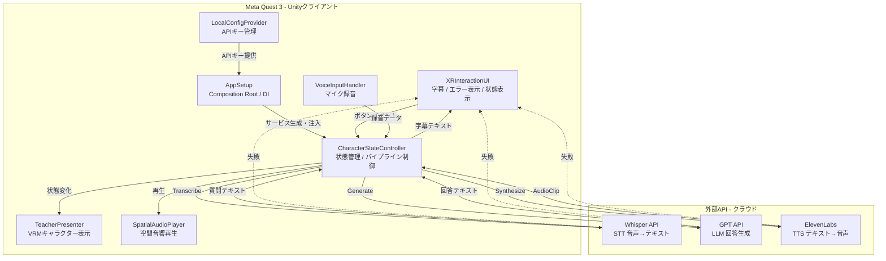
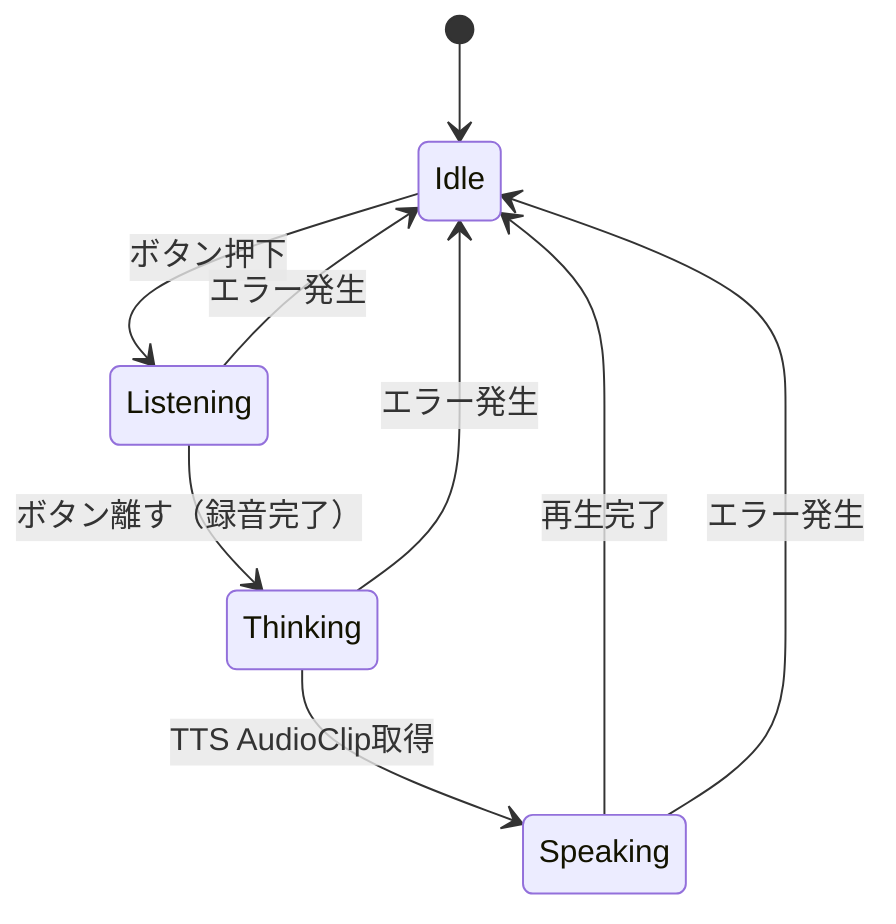
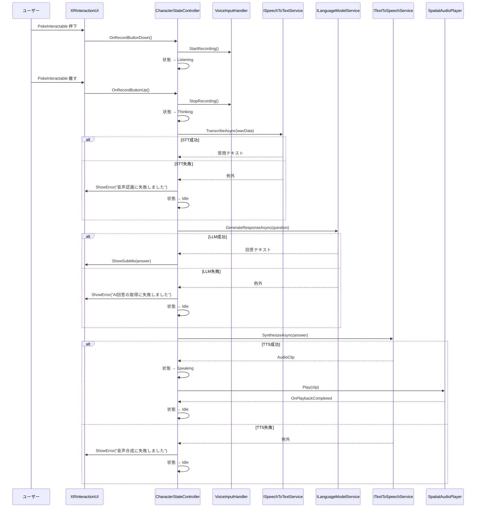
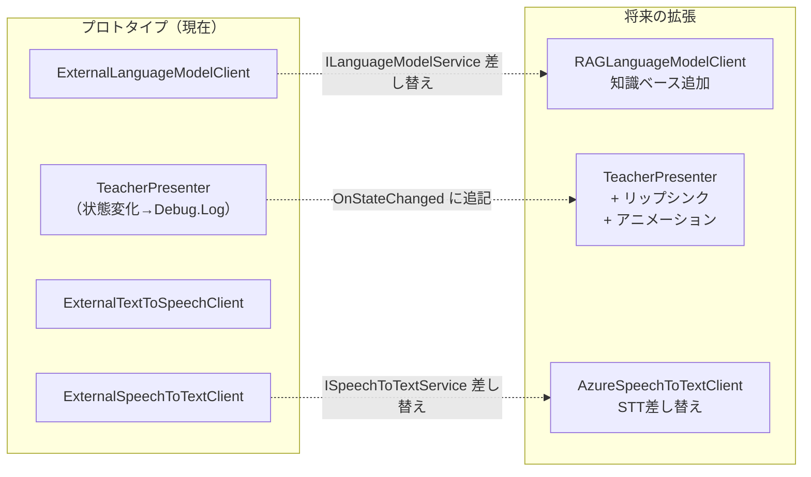

# プロトタイプ設計

> **対象デバイス**: Meta Quest 3  
> **Unityバージョン**: 6000.0.60f1  
> **目的**: 学生が発展的なXRアプリを開発するためのベースプロトタイプ  
> **方針**: シンプル・理解しやすい・拡張しやすい

---

## 1. システム概要

MR空間に表示された**先生キャラクター（VRM）**に音声で質問すると、  
AIが回答を生成し、先生の声でUnityが再生する教育支援システム。

| 項目 | 内容 |
|------|------|
| デバイス | Meta Quest 3 |
| Unityバージョン | 6000.0.60f1 |
| キャラクター | VRM形式（UniVRM読み込み） |
| STT | OpenAI Whisper API |
| LLM | OpenAI GPT系（gpt-4o-mini 推奨） |
| TTS | ElevenLabs |
| 通信 | UnityWebRequest（REST） |
| 非同期 | UniTask |
| UIモード | MRパススルー |

---

## 2. システム責務図



**Unityの責務（AI処理はしない）**

| コンポーネント | 配置 |
|---|---|
| `AppSetup` | シーンに1つだけのGameObject |
| `LocalConfigProvider` | Pure C#（AppSetup内でインスタンス化） |
| `VoiceInputHandler` | **XR Rig（Player）配下のGameObject** |
| `CharacterStateController` | キャラクターRoot GameObject |
| `TeacherPresenter` | キャラクターRoot GameObject |
| `SpatialAudioPlayer` | キャラクターHead/Mouth GameObject |
| `XRInteractionUI` | World Space Canvas |

---

## 3. キャラクター状態遷移

スキル定義に基づき、キャラクターは4つの状態を持つ。



| 状態 | 意味 | UI表示 | TeacherPresenter |
|---|---|---|---|
| **Idle** | 待機中 | — | 通常表示 |
| **Listening** | 録音中 | 「録音中...」 | （将来: 録音中エフェクト） |
| **Thinking** | AI処理中 | **「AIが考えています...」** | （将来: 考え中アニメーション） |
| **Speaking** | 話し中 | 回答字幕 | （将来: リップシンク） |

> [!TIP]
> **Thinking状態のUI表示は必須です。** Whisper APIは平均2〜4秒かかるため、
> フィードバックなしだとアプリが固まったように見えます。

---

## 4. システムアーキテクチャ図



---

## 5. APIキー管理

> [!CAUTION]
> **教育プロトタイプの注意事項**  
> このプロトタイプでは、Unityクライアントから各APIへ直接REST通信を行います。  
> `StreamingAssets/config.json` はAPKビルドに含まれるため、完全な秘匿にはなりません。  
> **実運用では、中間APIサーバーを設置してAPIキーをサーバー側で管理することを強く推奨します。**

```
教育プロトタイプ（本設計）:  Unity → API（直接通信）
実運用推奨構成:             Unity → 自前APIサーバー → API
```

### config.json テンプレート

```json
{
  "openAIApiKey": "sk-xxxxxxxxxxxxxxxxxxxx",
  "elevenLabsApiKey": "xxxxxxxxxxxxxxxxxxxxxxxxxxxxxxxx",
  "elevenLabsVoiceId": "xxxxxxxxxxxxxxxxxxxxxxxx",
  "systemPrompt": "あなたは大学の先生です。学生に優しく丁寧に説明してください。回答は簡潔で分かりやすくしてください。"
}
```

> [!CAUTION]
> `StreamingAssets/config.json` を `.gitignore` に必ず追加してください。

---

## 6. 音声処理フロー

```mermaid
graph LR
    A["マイク Microphone.Start"] -->|PCMデータ| B["WavUtility WAVエンコード"]
    B -->|WAV byte配列| C["ExternalSpeechToTextClient"]
    C -->|質問テキスト| D["ExternalLanguageModelClient"]
    D -->|回答テキスト| E["ExternalTextToSpeechClient"]
    E -->|AudioClip| F["SpatialAudioPlayer Play"]
    F -->|Play() 空間音響| G["AudioSource 音声出力"]
    D -->|回答テキスト| H["XRInteractionUI ShowSubtitle"]
```

### 音声→AudioClip 変換

`ExternalTextToSpeechClient.SynthesizeAsync()` は `AudioClip` を直接返します。  
内部で `DownloadHandlerAudioClip` を明示的に設定することで MP3 を正しく受信します。

> [!WARNING]
> `UnityWebRequestMultimedia.GetAudioClip()` だけでは MP3 streaming に失敗するケースがあります。  
> 必ず `www.downloadHandler` を明示的に設定してください。

```csharp
// ExternalTextToSpeechClient.cs の実装イメージ
public async UniTask<AudioClip> SynthesizeAsync(string text)
{
    string url = $"{BaseUrl}/text-to-speech/{_config.elevenLabsVoiceId}";
    using var www = new UnityWebRequest(url, "POST");

    // MP3受信のため DownloadHandlerAudioClip を明示的に設定
    www.downloadHandler = new DownloadHandlerAudioClip(url, AudioType.MPEG);
    // ヘッダー・ボディ設定（実装時に追加）

    await www.SendWebRequest();
    return DownloadHandlerAudioClip.GetContent(www);
}
```

### 音声フォーマット

| 用途 | フォーマット | 備考 |
|---|---|---|
| 録音（送信） | WAV (PCM **44100Hz** mono) | **Unity `Microphone` のデフォルト。Whisper側で自動対応。**<br>Whisper推奨は16000Hz。将来的に `UnityMicrophoneRecorder` の `SampleRate` を変更することで通信量削減が可能 |
| TTS受信 | MP3 → AudioClip変換 | `DownloadHandlerAudioClip` 明示設定が必須 |

---

## 7. エラーハンドリング設計

### 基本方針

- `async void` は使用しない → `UniTask` を使用
- 全API通信は `try/catch` で囲む
- エラー発生時は状態を `Idle` に戻す
- エラーは `XRInteractionUI.ShowError()` に表示する
- ログは `Debug.LogError` で出力する

### エラーハンドリング実装イメージ

```csharp
// CharacterStateController.cs
// STT→LLM→TTS の2段構成でエラーを各段でキャッチしIdle に戻す

private async UniTask RunFromLLMAsync(string question)
{
    string answer;
    try
    {
        answer = await _llmService.GenerateResponseAsync(question);
        ui.ShowSubtitle(answer);
    }
    catch (Exception e)
    {
        Debug.LogError($"[LLM] {e.Message}");
        ui.ShowError("AI回答の取得に失敗しました。");
        SetState(CharacterState.Idle);
        return;
    }

    try
    {
        SetState(CharacterState.Speaking);
        AudioClip clip = await _ttsService.SynthesizeAsync(answer);
        await _audioPlayer.PlayAsync(clip);
    }
    catch (Exception e)
    {
        Debug.LogError($"[TTS] {e.Message}");
        ui.ShowError("音声合成に失敗しました。");
    }
    finally { SetState(CharacterState.Idle); }
}
```

### エラー種別

| エラー | 表示メッセージ |
|---|---|
| STT失敗 | 「音声認識に失敗しました。」 |
| LLM失敗 | 「AI回答の取得に失敗しました。」 |
| TTS失敗 | 「音声合成に失敗しました。」 |

---

## 8. 使用技術一覧

| カテゴリ | 技術・ライブラリ |
|---|---|
| エンジン | Unity **6000.0.60f1** |
| XR SDK | Meta XR All-in-One SDK（最新） |
| XR UI | Meta XR Interaction SDK |
| VRMローダー | UniVRM **0.104.0**（Unity 6000.0.60f1 動作確認済み） |
| UI | Unity uGUI + TextMeshPro |
| STT | OpenAI Whisper API |
| LLM | OpenAI Chat Completions API（gpt-4o-mini 推奨） |
| TTS | ElevenLabs API |
| 通信 | UnityWebRequest |
| 非同期 | **UniTask**（async void は使用しない） |
| JSON | **JsonUtility**（Unity標準・追加インポート不要） |

> [!IMPORTANT]
> **JsonUtility の制限について**  
> `JsonUtility` はネストしたJSONのルート配列・`Dictionary` の直接シリアライズに非対応です。  
> 各APIクライアント実装時は、レスポンス構造に対応した `[Serializable]` ラッパークラスを用意してください。  
> - **Whisper API**: `{"text": "..."}` → フラット構造のため比較的シンプル  
> - **GPT API**: `choices[0].message.content` のネスト構造 → `GptResponse / GptChoice / GptMessage` クラスが必要  
> - **ElevenLabs**: バイナリ（MP3）レスポンスのためJSON解析不要

---

## 9. Unityフォルダ構成

```
Assets/
├── _MRCharBase/
│   ├── Scripts/
│   │   ├── App/                          ← 起動・DI
│   │   │   ├── AppSetup.cs               ← Composition Root
│   │   │   ├── LocalConfigProvider.cs    ← APIキー読込（IConfigProvider実装）
│   │   │   └── AppConfig.cs              ← config.jsonデータクラス
│   │   ├── Core/                         ← フロー制御
│   │   │   ├── CharacterStateController.cs
│   │   │   └── CharacterState.cs         ← 状態定義 enum
│   │   ├── Services/                     ← サービス層
│   │   │   ├── Interfaces/
│   │   │   │   ├── ISpeechToTextService.cs
│   │   │   │   ├── ILanguageModelService.cs
│   │   │   │   ├── ITextToSpeechService.cs
│   │   │   │   ├── ISpatialAudioPlayer.cs
│   │   │   │   ├── IAudioRecorder.cs        ← 録音抽象化
│   │   │   │   └── IConfigProvider.cs       ← 設定読込抽象化
│   │   │   ├── External/                 ← API実装
│   │   │   │   ├── ExternalSpeechToTextClient.cs
│   │   │   │   ├── ExternalLanguageModelClient.cs
│   │   │   │   └── ExternalTextToSpeechClient.cs
│   │   │   └── Mock/                     ← Mock実装（ネットワーク不要）
│   │   │       ├── MockSpeechToTextService.cs
│   │   │       ├── MockLanguageModelService.cs
│   │   │       └── MockTextToSpeechService.cs
│   │   ├── Voice/                        ← 音声入力
│   │   │   ├── VoiceInputHandler.cs      ← IAudioRecorder実装
│   │   │   ├── UnityMicrophoneRecorder.cs ← Unityマイク実装
│   │   │   └── WavUtility.cs             ← WAVエンコード
│   │   ├── Audio/                        ← 音声出力
│   │   │   └── SpatialAudioPlayer.cs     ← 空間音響再生
│   │   ├── UI/                           ← XR UI
│   │   │   └── XRInteractionUI.cs        ← 字幕 / エラー / ボタン
│   │   └── Character/                   ← キャラクター表示
│   │       └── TeacherPresenter.cs       ← VRM / 状態別表示
│   ├── Scenes/
│   │   └── MRCharBaseScene.unity
│   ├── Prefabs/
│   │   ├── TeacherCharacter.prefab
│   │   └── UICanvas.prefab
│   └── VRM/
│       └── teacher.vrm
├── StreamingAssets/
│   └── config.json                       ← .gitignore に追加必須
├── UniVRM/
└── Plugins/
```

---

## 10. クラス構成

### 10.1 インターフェース

```csharp
// ISpeechToTextService.cs
public interface ISpeechToTextService
{
    UniTask<string> TranscribeAsync(byte[] wavData);
}

// ILanguageModelService.cs
public interface ILanguageModelService
{
    UniTask<string> GenerateResponseAsync(string userMessage);
}

// ITextToSpeechService.cs
public interface ITextToSpeechService
{
    UniTask<AudioClip> SynthesizeAsync(string text);
}

// ISpatialAudioPlayer.cs
public interface ISpatialAudioPlayer
{
    UniTask PlayAsync(AudioClip clip); // 再生完了まで待機
}

// IAudioRecorder.cs
// 将来: UnityMicrophoneRecorder / MetaVoiceRecorder に差し替え可能
public interface IAudioRecorder
{
    void StartRecording();
    byte[] StopRecording(); // WAV byte[] を返す
}

// IConfigProvider.cs
// 将来: クラウド設定・環境別設定への展開に対応
// Android StreamingAssets は非同期読込必須のため async にする
public interface IConfigProvider
{
    UniTask<AppConfig> LoadAsync();
}

// AppConfig.cs
// config.json の構造に対応するデータクラス
[Serializable]
public class AppConfig
{
    public string openAIApiKey;
    public string elevenLabsApiKey;
    public string elevenLabsVoiceId;
    public string systemPrompt;
}
```

### 10.2 AppSetup（Composition Root）

> [!CAUTION]
> Android（Quest3実機）では `StreamingAssets` 内ファイルは **ZIP内部に圧縮保存**されるため、  
> `File.ReadAllText()` では読めません。**`UnityWebRequest` での非同期読込が必須**です。

```csharp
// AppSetup.cs
// 責務: 全サービスを生成し、CharacterStateController に注入する。シーンに1つだけ配置。
public class AppSetup : MonoBehaviour
{
    [SerializeField] private CharacterStateController characterController;
    [SerializeField] private SpatialAudioPlayer       audioPlayer;
    [SerializeField] private VoiceInputHandler        voiceInput;  // IAudioRecorder 実装済み

    [SerializeField] private bool useMock = false;

    private void Start() => InitAsync().Forget(); // 非同期初期化（Awake ではなく Start 使用）

    private async UniTaskVoid InitAsync()
    {
        // マイク権限リクエスト（非ブロッキング：ダイアログは非同期で表示される）
        // 権限取得完了を待つには Callback か Unity Permissions API を使う必要がある
        // プロトタイプでは「起動後すぐに録音しない」前提で許容する
        if (!Permission.HasUserAuthorizedPermission(Permission.Microphone))
            Permission.RequestUserPermission(Permission.Microphone);

        // config.json 読込失敗時はエラーを表示して中断（起動不可能なまま放置しない）
        AppConfig config;
        try { config = await new LocalConfigProvider().LoadAsync(); }
        catch (Exception e)
        {
            Debug.LogError($"[AppSetup] 設定読込失敗: {e.Message}");
            if (characterController != null)
                characterController.ShowFatalError("設定ファイルの読み込みに失敗しました。");
            return;
        }

        ISpeechToTextService  stt   = useMock ? new MockSpeechToTextService()  : new ExternalSpeechToTextClient(config);
        ILanguageModelService llm   = useMock ? new MockLanguageModelService() : new ExternalLanguageModelClient(config);
        ITextToSpeechService  tts   = useMock ? new MockTextToSpeechService()  : new ExternalTextToSpeechClient(config);
        ISpatialAudioPlayer   audio = audioPlayer; // MonoBehaviour は Inspector 経由 DI
        IAudioRecorder        rec   = voiceInput;  // VoiceInputHandler : IAudioRecorder

        characterController.Inject(stt, llm, tts, audio, rec);
    }
}
```

> [!TIP]
> **【Quest実機の注意】マイク権限の非同期取得について**
> Android / Quest では `Permission.RequestUserPermission()` は非同期でダイアログが表示されます。
> ダイアログで「許可」を押す前に録音ボタンを押してしまうと録音に失敗し、
> 「録音データが取得できませんでした」というエラーになります（プロトタイプ設計によりクラッシュはしません）。
> 初回起動時はダイアログで「許可」を押してから録音ボタンを操作するようにしてください。  
> また、権限ダイアログで**「拒否」を選んだ場合**はアプリから再リクエストできません。
> Quest本体の「設定 → アプリ → 対象アプリ → 権限」から手動でマイクをオンにしてください。

```csharp
// LocalConfigProvider.cs
// Android実機対応: UnityWebRequest で StreamingAssets を非同期読込
public class LocalConfigProvider : IConfigProvider
{
    public async UniTask<AppConfig> LoadAsync()
    {
        string path = Path.Combine(Application.streamingAssetsPath, "config.json");
        using var www = UnityWebRequest.Get(path);
        await www.SendWebRequest();
        if (www.result != UnityWebRequest.Result.Success)
            throw new Exception($"[Config] 読込失敗: {www.error}");
        return JsonUtility.FromJson<AppConfig>(www.downloadHandler.text);
    }
}
```

> [!TIP]
> `useMock = true` にするだけでAPI通信なしに全体フローを動作確認できます。  
> `IAudioRecorder` / `ISpatialAudioPlayer` も DI しているため、将来 Mock実装に差し替えられます。

### 10.3 CharacterState（状態定義）

```csharp
// CharacterState.cs
public enum CharacterState
{
    Idle,       // 待機中
    Listening,  // 録音中
    Thinking,   // AI処理中
    Speaking    // 話し中
}
```

### 10.4 CharacterStateController（中心制御）

> **設計方針**: 状態管理はすべてここで一元管理する。録音開始・停止も Controller 経由で行う。

```csharp
// CharacterStateController.cs
// 責務: 状態管理 + 音声AIパイプライン制御
// キャラクターRoot GameObjectに配置
public class CharacterStateController : MonoBehaviour
{
    [SerializeField] private XRInteractionUI  ui;
    [SerializeField] private TeacherPresenter presenter;

    private ISpeechToTextService  _sttService;
    private ILanguageModelService _llmService;
    private ITextToSpeechService  _ttsService;
    private ISpatialAudioPlayer   _audioPlayer;
    private IAudioRecorder        _recorder;    // AppSetup から Inject される
    private CharacterState        _state;
    // ★ プロトタイプでは未使用。将来、処理中キャンセルボタンを追加する際に
    //   _cts.Cancel() を呼ぶ。現在は RunPipelineAsync() で生成のみ行う。
    //   実際にキャンセルを有効にするには、TranscribeAsync / GenerateResponseAsync /
    //   SynthesizeAsync の各インターフェースに CancellationToken を引数として追加し、
    //   _cts.Token を渡す必要がある（インターフェース変更が伴う将来拡張）。
    private CancellationTokenSource _cts;

    // AppSetup から呼ばれる（依存性注入）
    public void Inject(
        ISpeechToTextService  stt,
        ILanguageModelService llm,
        ITextToSpeechService  tts,
        ISpatialAudioPlayer   audio,
        IAudioRecorder        recorder) // 引数に IAudioRecorder を追加
    {
        _sttService  = stt;
        _llmService  = llm;
        _ttsService  = tts;
        _audioPlayer = audio;
        _recorder    = recorder;
    }

    // PokeInteractable の WhenSelectingStarted イベントに接続（引数なしでInspectorから呼べる）
    public void OnRecordButtonDown()
    {
        if (_recorder == null) return; // Inject 完了前に呼ばれた場合は無視
        if (_state != CharacterState.Idle) return;
        SetState(CharacterState.Listening);
        ui.ShowSubtitle("録音中..."); // Listening 状態のフィードバック（状態遷移表と対応）
        _recorder.StartRecording();
    }

    // PokeInteractable の WhenSelectingEnded イベントに接続（引数なしでInspectorから呼べる）
    public void OnRecordButtonUp()
    {
        if (_recorder == null) return; // Inject 完了前に呼ばれた場合は無視
        if (_state != CharacterState.Listening) return;
        byte[] wavData = _recorder.StopRecording();
        RunPipelineAsync(wavData).Forget();
    }

    private async UniTaskVoid RunPipelineAsync(byte[] wavData)
    {
        _cts = new CancellationTokenSource();

        SetState(CharacterState.Thinking);
        ui.ShowSubtitle("AIが考えています..."); // Thinking中フィードバック（必須）

        // 録音データが空の場合はAPIに送らずIdle に戻す（マイク未接続・録音直後停止対策）
        if (wavData == null || wavData.Length == 0)
        {
            ui.ShowError("録音データが取得できませんでした。");
            SetState(CharacterState.Idle);
            return;
        }

        string question;
        try { question = await _sttService.TranscribeAsync(wavData); }
        catch (Exception e)
        {
            Debug.LogError($"[STT] {e.Message}");
            ui.ShowError("音声認識に失敗しました。");
            SetState(CharacterState.Idle);
            return;
        }

        await RunFromLLMAsync(question); // STT後はLLM以降の共通処理へ
    }

    // デバッグ用: STTをスキップしてテキストを直接LLMに送る
    // Editorでボタンに割り当ててネットワーク不要でLLM+TTS+再生を確認できる
    // ※ UniTaskVoid は呼び出し元が完了を待てない。デバッグ専用のため許容。
    //   将来、テスト等で完了を待ちたい場合は UniTask に変更すること。
    public async UniTaskVoid OnDebugInput(string question)
    {
        if (string.IsNullOrEmpty(question)) return; // 空入力は無視
        try
        {
            SetState(CharacterState.Thinking);
            ui.ShowSubtitle("AIが考えています...");
            await RunFromLLMAsync(question); // STT をスキップ
        }
        catch (Exception e)
        {
            Debug.LogError($"[DebugInput] {e.Message}");
            ui.ShowError("デバッグ入力でエラーが発生しました。");
            SetState(CharacterState.Idle);
        }
    }

    // LLM→TTS→再生の共通処理（RunPipelineAsync・OnDebugInput 両方から呼ぶ）
    private async UniTask RunFromLLMAsync(string question)
    {
        string answer;
        try
        {
            answer = await _llmService.GenerateResponseAsync(question);
            ui.ShowSubtitle(answer);
        }
        catch (Exception e)
        {
            Debug.LogError($"[LLM] {e.Message}");
            ui.ShowError("AI回答の取得に失敗しました。");
            SetState(CharacterState.Idle);
            return;
        }

        try
        {
            SetState(CharacterState.Speaking);
            AudioClip clip = await _ttsService.SynthesizeAsync(answer);
            await _audioPlayer.PlayAsync(clip);
        }
        catch (Exception e)
        {
            Debug.LogError($"[TTS] {e.Message}");
            ui.ShowError("音声合成に失敗しました。");
        }
        finally { SetState(CharacterState.Idle); }
    }

    private void SetState(CharacterState newState)
    {
        _state = newState;
        presenter.OnStateChanged(newState);
    }

    // AppSetup から設定読み込み失敗時に呼ばれる致命的エラー表示
    // Inject が完了していないため、ui は SerializeField 経由で直接参照する
    public void ShowFatalError(string message) => ui.ShowError(message);

    private void OnDestroy()
    {
        _cts?.Cancel();
        _cts?.Dispose();
    }
}
```

### 10.5 TeacherPresenter（状態別表示）

```csharp
// TeacherPresenter.cs
// 責務: 状態に応じたキャラクター表示制御
// 将来: 各状態にアニメーション・リップシンクを追加するだけでよい
public class TeacherPresenter : MonoBehaviour
{
    // 将来: [SerializeField] private Animator _animator;
    // 将来: [SerializeField] private OVRLipSyncContext _lipSync;

    public void OnStateChanged(CharacterState state)
    {
        switch (state)
        {
            case CharacterState.Idle:      Idle();      break;
            case CharacterState.Listening: Listening(); break;
            case CharacterState.Thinking:  Thinking();  break;
            case CharacterState.Speaking:  Speaking();  break;
        }
    }

    private void Idle()     => Debug.Log("[Teacher] Idle");
    private void Listening() => Debug.Log("[Teacher] Listening");
    private void Thinking()  => Debug.Log("[Teacher] Thinking");
    private void Speaking()  => Debug.Log("[Teacher] Speaking");
    // 将来: 各メソッドに _animator.SetTrigger("xxx") を追加
}
```

### 10.6 VoiceInputHandler（録音担当）

> [!IMPORTANT]
> **配置場所: XR Rig（Player）配下のGameObject**  
> **`VoiceInputHandler` 自身が `IAudioRecorder` を実装する**。これにより `AppSetup` でそのまま DI できる。

```csharp
// VoiceInputHandler.cs
// 責務: IAudioRecorder を実装し、マイク録音のみ担当する
// 配置: XR Rig（Player）配下のGameObject
// AppSetup から IAudioRecorder として Inject される
public class VoiceInputHandler : MonoBehaviour, IAudioRecorder
{
    // IAudioRecorder 内部実装は UnityMicrophoneRecorder で抽象化
    // 将来: new MetaVoiceRecorder() に内部差し替え可能
    private IAudioRecorder _impl = new UnityMicrophoneRecorder();

    // IAudioRecorder 実装
    public void StartRecording() => _impl.StartRecording();
    public byte[] StopRecording()  => _impl.StopRecording();
}

// UnityMicrophoneRecorder.cs
// 責務: Unity の Microphone API を使って録音し、WAV byte[]を返す
public class UnityMicrophoneRecorder : IAudioRecorder
{
    private AudioClip _clip;
    private bool _isRecording = false;  // Microphone.Start() が失敗した場合の保護フラグ
    private const int MaxSeconds = 30;  // 最大録音秒数
    private const int SampleRate  = 44100; // Unity Microphone のデフォルト

    public void StartRecording()
    {
        _clip = Microphone.Start(null, false, MaxSeconds, SampleRate);
        _isRecording = (_clip != null);
    }

    public byte[] StopRecording()
    {
        if (!_isRecording) return Array.Empty<byte>(); // 録音未開始なら空を返す
        _isRecording = false;

        int pos = Microphone.GetPosition(null);
        Microphone.End(null);
        
        // サンプル数が0以下の場合は空配列を返す（Quest実機での GetPosition==0 回避）
        // 呼び出し側（RunPipelineAsync）で wavData 空チェック済み
        if (pos <= 0 || _clip == null) return Array.Empty<byte>();
        
        // PCM データを取り出し WAV にエンコード
        float[] samples = new float[pos * _clip.channels];
        _clip.GetData(samples, 0);
        return WavUtility.FromAudioClipData(samples, pos, _clip.channels, SampleRate);
    }
}
```

> [!TIP]
> **デバッグ用テキスト入力**: `CharacterStateController.OnDebugInput(text)` をEditorボタンに割り当てるか、Inspectorから直接呼び出してください。

### 10.7 SpatialAudioPlayer（空間音響）

> [!WARNING]
> `PlayOneShot()` では `audioSource.isPlaying` が正確に検知できません。  
> 必ず `audioSource.clip = clip; audioSource.Play();` を使ってください。

```csharp
// SpatialAudioPlayer.cs
// 責務: キャラクターの位置から空間音響として再生する
// キャラクターの Head / Mouth GameObject に配置する
public class SpatialAudioPlayer : MonoBehaviour, ISpatialAudioPlayer
{
    [SerializeField] private AudioSource audioSource;

    public async UniTask PlayAsync(AudioClip clip)
    {
        // Inspector 未設定または clip 引数エラーの場合は即 return.
        // 音は出ないが Controller 側には制御が戻り、Idle 状態へ復帰するためアプリは進行可能
        if (audioSource == null || clip == null) return; // null ガード
        audioSource.spatialBlend = 1.0f;  // 3D空間音響
        audioSource.clip = clip;          // PlayOneShot ではなく clip に代入
        audioSource.Play();

        // clip に代入した場合は isPlaying で正確に完了検知できる
        // GetCancellationTokenOnDestroy: GameObject 廃棄時（シーン遺移・クラッシュ）に自動キャンセル
        await UniTask.WaitWhile(() => audioSource.isPlaying,
            cancellationToken: this.GetCancellationTokenOnDestroy());
        
        // 再生完了後にメモリを解放
        audioSource.clip = null;
        UnityEngine.Object.Destroy(clip);
    }
}
```

> [!TIP]
> `audioSource.Play()` の直後、`isPlaying` が1フレーム遅れて `true` になるケースが実機で稀に発生します。  
> 再生完了を即座に誤検知して Idle に戻る症状が出た場合は、`Play()` の直後に `await UniTask.NextFrame()` を1行追加してください。  
> ```csharp
> audioSource.Play();
> await UniTask.NextFrame(); // isPlaying の遅延初期化を回避
> await UniTask.WaitWhile(...);
> ```

### 10.8 XRInteractionUI

**ボタン実装方針**: Meta XR Interaction SDK の **`PokeInteractable`** を使用します（指でタッチして押す操作）。コントローラーボタンはサブ入力として OVR Input で補完します。

```
シーン構成（ボタン周り）
World Space Canvas
  └─ RecordButton (GameObject)
       ├─ PokeInteractable         ← 指タッチ検知
       ├─ InteractableUnityEventWrapper
       │    ├─ WhenSelectingStarted → CharacterStateController.OnRecordButtonDown()
       │    └─ WhenSelectingEnded   → CharacterStateController.OnRecordButtonUp()
       └─ XRInteractionUI (MonoBehaviour)
```

> [!TIP]
> `OnRecordButtonDown()` / `OnRecordButtonUp()` は引数なしのメソッドです。  
> `InteractableUnityEventWrapper` の UnityEvent から **Inspector のみ**で接続できます。

```csharp
// XRInteractionUI.cs
// 責務: 字幕 / エラー / 状態インジケーター
// World Space Canvas に配置する（Meta XR Interaction SDK対応）
public class XRInteractionUI : MonoBehaviour
{
    [SerializeField] private TMP_Text subtitleText;
    [SerializeField] private Color normalColor = Color.white;
    [SerializeField] private Color errorColor  = Color.red;

    public void ShowSubtitle(string text)
    {
        subtitleText.color = normalColor;
        subtitleText.text  = text;
    }

    public void ShowError(string message)
    {
        subtitleText.color = errorColor;
        subtitleText.text  = $"⚠ {message}";
    }

    public void Clear() => subtitleText.text = string.Empty;
}
```

### 10.9 スクリプト一覧

| スクリプト | 種別 | 責務 |
|---|---|---|
| `AppSetup` | MonoBehaviour | Composition Root / 全サービスDI |
| `LocalConfigProvider` | Pure C# | config.json 読込（IConfigProvider実装） |
| `CharacterStateController` | MonoBehaviour | 状態管理 / パイプライン制御 / 録音制御 |
| `CharacterState` | Enum | 状態定義（Idle/Listening/Thinking/Speaking） |
| `VoiceInputHandler` | MonoBehaviour | マイク録音のみ（IAudioRecorder利用） |
| `UnityMicrophoneRecorder` | Pure C# | IAudioRecorder実装（Unity Microphone API） |
| `WavUtility` | Pure C# | PCM→WAVエンコード |
| `SpatialAudioPlayer` | MonoBehaviour | 空間音響再生（ISpatialAudioPlayer実装） |
| `XRInteractionUI` | MonoBehaviour | 字幕 / エラー表示（ボタンイベント発火元は `InteractableUnityEventWrapper`） |
| `TeacherPresenter` | MonoBehaviour | VRM / 状態別表示 |
| `ExternalSpeechToTextClient` | Pure C# | STT API通信 |
| `ExternalLanguageModelClient` | Pure C# | LLM API通信 |
| `ExternalTextToSpeechClient` | Pure C# | TTS API通信（AudioClip返却） |
| `MockSpeechToTextService` | Pure C# | STT Mock |
| `MockLanguageModelService` | Pure C# | LLM Mock |
| `MockTextToSpeechService` | Pure C# | TTS Mock |
| `ISpeechToTextService` | Interface | STT抽象化 |
| `ILanguageModelService` | Interface | LLM抽象化 |
| `ITextToSpeechService` | Interface | TTS抽象化 |
| `ISpatialAudioPlayer` | Interface | 再生抽象化 |
| `IAudioRecorder` | Interface | 録音抽象化（将来: MetaVoiceRecorder対応） |
| `IConfigProvider` | Interface | 設定読込抽象化（将来: クラウド設定対応） |

> [!NOTE]
> **【プロトタイプの仕様】会話履歴について**
> 本設計の `ExternalLanguageModelClient` は教育目的のシンプルさを重視し、
> **会話履歴を持たない Stateless（1問1答）な設計** としています。
> 会話履歴（文脈の引き継ぎ）の保持は、将来の拡張機能として位置付けています。

---

## 11. 開発ロードマップ

### ステップ別チェックリスト

#### Step 1: 基盤構築
- [ ] Unity 6000.0.60f1 プロジェクト作成（URP）
- [ ] Meta XR All-in-One SDK インポート・OVRCameraRig 配置
- [ ] パススルー設定・Quest3実機で動作確認

#### Step 2: キャラクター
- [ ] UniVRM **0.104.0** インポート・VRMモデル配置
- [ ] `CharacterState.cs` / `TeacherPresenter.cs` 実装

#### Step 3: Mock動作確認（ネットワーク不要・Editor実行）

> [!TIP]
> **Mockから始めることで全体フローをEditorで素早く確認できます。**  
> マイク・XR挙動はEditorと実機で異なるため、UIとフローの確認に留めてください。

- [ ] `AppSetup.cs`（`useMock = true`）・`CharacterStateController.cs` 実装
- [ ] `Mock*.cs` 3種・`XRInteractionUI.cs` 実装
- [ ] Editor: `OnDebugInput()` でLLM→TTS→再生フロー確認（STTスキップ）
- [ ] Editor: 状態遷移・字幕表示・エラー表示を確認

#### Step 4: 音声入力・ボタンUI
- [ ] `UnityMicrophoneRecorder.cs` + `WavUtility.cs` 実装
- [ ] `VoiceInputHandler.cs` 実装
- [ ] `SpatialAudioPlayer.cs` 実装（`clip + Play()` で完了検知）
- [ ] World Space Canvas + **PokeInteractable** ボタン配置
- [ ] `InteractableUnityEventWrapper` で CSC メソッドをInspector接続

#### Step 5: API接続（`useMock = false`）
- [ ] `LocalConfigProvider.cs` + `config.json` + `.gitignore` 設定
- [ ] `ExternalSpeechToTextClient.cs` 実装・Editor疎通確認
- [ ] `ExternalLanguageModelClient.cs` 実装・Editor疎通確認
- [ ] `ExternalTextToSpeechClient.cs` 実装・Editor疎通確認
- [ ] Editorでエンドツーエンド動作確認

#### Step 6: Quest3実機確認（最優先ビルドターゲット）

> [!IMPORTANT]
> **マイク権限・PokeInteractable・パススルーはQuest3実機でのみ正確に確認できます。**

- [ ] Android Build Settings（Quest3向け）・APKビルド
- [ ] マイク権限ダイアログ表示確認
- [ ] PokeInteractable ボタン動作確認（指タッチ操作）
- [ ] MR空間での完全動作確認

---

## 12. 将来拡張ポイント

### 設計上の拡張ポイント



| 拡張機能 | 実装方法 | 変更箇所 |
|---|---|---|
| **RAG** | `ILanguageModelService` 実装クラスを追加 | `AppSetup.cs` の1行差し替え |
| **リップシンク** | `TeacherPresenter.Speaking()` に OVRLipSync を追加 | `TeacherPresenter` のみ |
| **アニメーション** | `TeacherPresenter` 各メソッドに Animator を追加 | `TeacherPresenter` のみ |
| **STT差し替え** | `ISpeechToTextService` 実装クラスを追加（例: `AzureSpeechToTextClient`） | `AppSetup.cs` の1行差し替え |
| **会話履歴** | `ExternalLanguageModelClient` にメッセージリストを追加 | `ExternalLanguageModelClient` のみ |
| **処理キャンセル** | `CancellationTokenSource` を `CharacterStateController` に追加 | ボタン長押し等のイベントで `_cts.Cancel()` |
| **クラウド設定** | `IConfigProvider` 実装クラスを追加 | `AppSetup.cs` の1行 |
| **中間APIサーバー** | 各Clientの送信先URLを変更 | 各Clientの定数1行 |
| **音声ストリーミング** | TTS生成しながら再生する仕組みを `ITextToSpeechService` に追加 | `ExternalTextToSpeechClient` |

### VoiceConversationPipeline（将来の設計改善）

現在の `CharacterStateController` は STT→LLM→TTS を直接制御しています。  
将来、Controllerの責務をさらにシンプルにしたい場合は、パイプラインを独立したクラスに切り出せます。

```csharp
// 将来実装例: Controller が pipeline.Run() を呼ぶだけになる
public class VoiceConversationPipeline
{
    public async UniTask<string> RunAsync(byte[] wavData)
    {
        string question = await _sttService.TranscribeAsync(wavData);
        string answer   = await _llmService.GenerateResponseAsync(question);
        AudioClip clip  = await _ttsService.SynthesizeAsync(answer);
        await _audioPlayer.PlayAsync(clip);
        return answer; // 字幕表示用に返す
    }
}

// CharacterStateController はこれだけになる
string answer = await _pipeline.RunAsync(wavData);
ui.ShowSubtitle(answer);
```

> このリファクタリングはプロトタイプには不要ですが、コードが大きくなった際に検討してください。

---

## 13. Inspector 配線チェックリスト

XR アプリや Unity 初心者が陥りやすい `NullReferenceException` を防ぐため、以下の Inspector 設定を必ず確認してください。

- **AppSetup GameObject**
  - [ ] `characterController`: シーン内の CharacterStateController をアタッチ
  - [ ] `audioPlayer`: シーン内の SpatialAudioPlayer をアタッチ
  - [ ] `voiceInput`: シーン内の VoiceInputHandler をアタッチ
- **CharacterRoot GameObject (CharacterStateController)**
  - [ ] `ui`: シーン内の XRInteractionUI をアタッチ
  - [ ] `presenter`: このオブジェクトの TeacherPresenter をアタッチ
- **Head/Mouth GameObject (SpatialAudioPlayer)**
  - [ ] `audioSource`: このオブジェクトにアタッチした AudioSource コンポーネントを設定
- **XRInteractionUI (Record Button)**
  - [ ] `InteractableUnityEventWrapper` の `WhenSelectingStarted` : CharacterStateController の `OnRecordButtonDown` に接続
  - [ ] `InteractableUnityEventWrapper` の `WhenSelectingEnded` : CharacterStateController の `OnRecordButtonUp` に接続

---

*設計書バージョン: 4.3 | 更新日: 2026-03-07*
